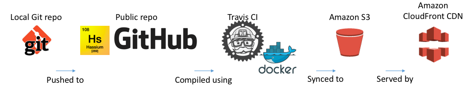

== Part 4.1 - Serving Content from AWS

=== S3 Storage

In the git repo holding the content a naming convention using the names of branches correspond
to a production and staging environment for the website. When code is pushed to the GitHub
repo test branch a Travis CI build is kicked off which runs a deployments script which syncs
the generated artifacts to a specific location within the S3 bucket.

.Bucket file structure
----
hassiumlabs-website/
├── production
│   ├── labs
│   └── site
└── test
    ├── labs
    └── site
----

.travis-deploy script
[source,bash]
----
if [ "$TRAVIS_BRANCH" == "master" ]; then
  aws s3 sync _book/ s3://hassiumlabs-website/production/labs/lab-001-electronic-publishing/ --delete
fi

if [ "$TRAVIS_BRANCH" == "test" ]; then
  aws s3 sync _book/ s3://hassiumlabs-website/test/labs/lab-001-electronic-publishing/ --delete
fi
----

=== IAM Service User

To allow Travis CI to publish to S3 an IAM (Identity and Access Management) user with API
credentials was created which allows read/write access to the S3 bucket in which the finished
artifacts are staged. The user credentials can be configured within the Travis CI build and
injected into the build as environment variables so you don't have to hard-code credentials into
a build script.

[source,javascript]
----
{
    "Version": "2012-10-17",
    "Statement": [
        {
            "Effect": "Allow",
            "Action": [
                "s3:ListBucket"
            ],
            "Resource": [
                "arn:aws:s3:::hassiumlabs-website"
            ]
        },
        {
            "Effect": "Allow",
            "Action": [
                "s3:PutObject",
                "s3:GetObject",
                "s3:DeleteObject"
            ],
            "Resource": [
                "arn:aws:s3:::hassiumlabs-website/*"
            ]
        }
    ]
}
----

=== CloudFront Content Distribution Network

When configuring CloudFront, production and test distributions were created which both have base origin
settings of the same bucket but use different origin paths within the bucket (/production/site or /test/labs). Each
of the distributions may also have different settings like the Time To Live (TTL) which is much more aggressive for
the production site to allow for more effective caching and rather short for the test site so updates can be
previewed more rapidly.

=== Route53 DNS

Both the production and test CloudFront distributions have their own DNS records which in Route53
are set to A and AAAA (IPV6) alias records pointing to the CloudFront distribution names.

=== Data Flow

